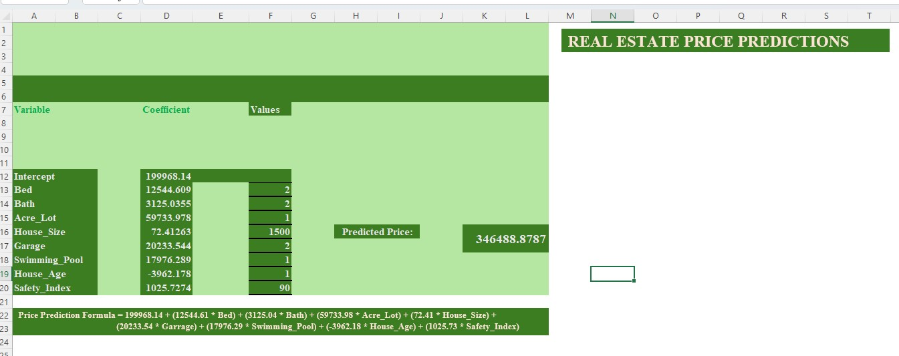
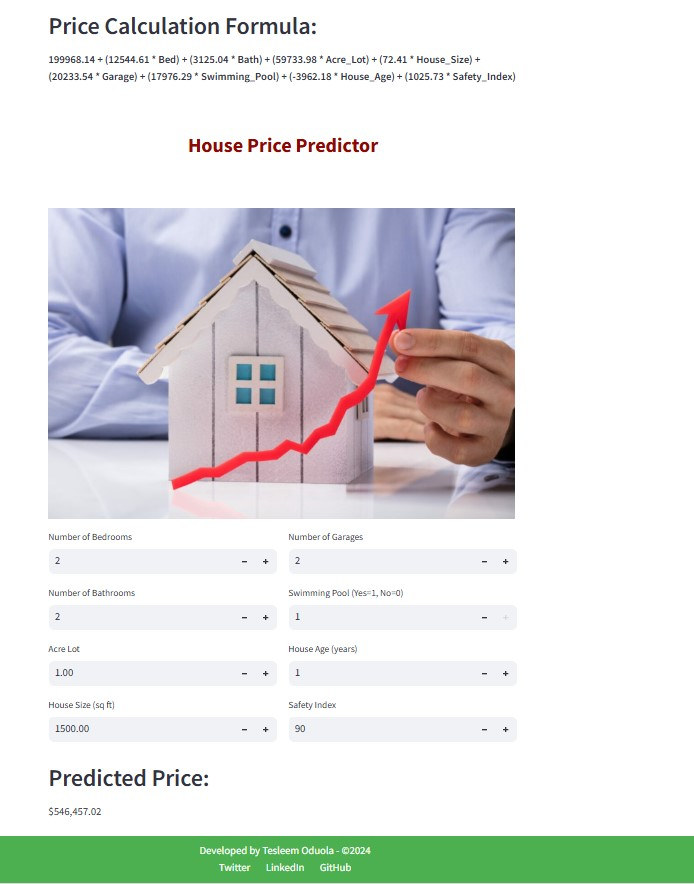

# Real Estate Price Prediction

## Table of Contents
- [Project Overview](#project-overview)
- [Project Objective](#project-objective)
- [Data Sources](#data-sources)
- [Data Processing](#data-processing)
- [Real Estate Price Prediction Calculator](#real-estate-price-prediction-calculator)
- [Key Metrics and Insights](#key-metrics-and-insights)
- [Model Deployment](#model-deployment)
- [Conclusion](#conclusion)

## Project Overview
RealEstate Bud, a leading real estate company in Manila was facing a significant challenge: To accurately appraise properties in a rapidly changing market. Manila's property values were influenced by a myriad of factors such as urban development projects, local ordinances, and buyer preferences, which were changing at an unprecedented pace. Because inaccurate appraisal can lead to either missed opportunities for clients or overpriced listings that can be remain stagnant in the market, RealEstate Bud needed to develop a robust and adaptive valuation model to accurately predict property values despite the dynamic nature of the real estate market. 

## Project Objective
The goal of this project is to create a robust valuation model utilizing Multiple Linear Regression using excel, incorporating a number of factors. This model aims to significantly enhance the accuracy and transparency of property valuations, bridging the gap between estimated and actual property values.

## Data Sources
The dataset used in this project was provided by 10Alytics. The dataset contains Bed, Bath, Acre_Lot, House_Size, Garage, Swimming_Pool, House_Age, Safety_Index.

## Data Processing
In the process of handling the data, data cleanning was performed by systematically examined the dataset to identify and eliminate any duplicate entries. Also, descriptive statistics of the property price to check the mean, standard devation, median, mode, skewness, min, max and range was done. Computed correlation matrix to understand relationships between variables and identify multicollinearity issues. Regression analysis using the Data Analysis Toolpak was performed and key metrics such as coefficients, R-Square, Adjusted R-Square, p-values, and confidence intervals were extracted from the regression output. Through the utilization of the "IF"and "ISBLANK" function, prediction calculator for prediction prices was developed.

## Real Estate Price Prediction Calculator

## Key Metrics and Insight
   ### Correlation Matrix
   - Intercept 218,404.42
   - The price of a property is most strongly influenced by the house size, number of bathrooms, and presence of a garage. The age of the house negatively
     impacts the price, while safety, the presence of a swimming pool, and lot size have a positive but less pronounced effect.
   ### Regression Statistics
   - The regression model exhibits strong predictive power, with a high Multiple R (0.90), R Square (0.816), and Adjusted R Square ()0.812, indicating that 
     it explains a significant portion of the variance in property prices.
   - The standard error(27960.97), while providing a measure of the prediction error, should be evaluated in the context of the price range of the properties 
     being studied. With 400 observations, the model is based on a solid dataset, further supporting its reliability. This suggests that the model developed 
     for RealEstateBud using Excel's multiple linear regression capabilities is effective in predicting property values in Manila's dynamic real estate market.
   ### Regression Output
   - Significant predictors (p-value < 0.05): Bed, Acre_Lot, House_Size, Garage, Swimming_Pool, House_Age, Safety_Index.
   - Insignificant predictor (p-value > 0.05): Bath
   - The coefficients indicate the direction and magnitude of the relationship between each independent variable and the dependent variable (price).

## Model Deployment
The model was deployed using Streamlit.

## Conclusion
The model's predictor explain a significant portion of the variation in property prices, making it a useful tool for valuation in the dynamic real estate market of Manila.
